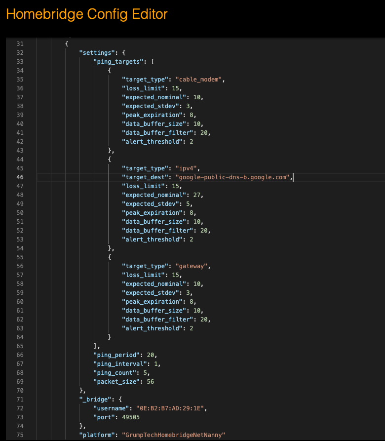

# Homebridge Net Nanny

[Homebridge Net Nanny](https://github.com/pricemi115/homebridge-grumptech-netnanny), by [GrumpTech](https://github.com/pricemi115/), is a [Homebridge](https://homebridge.io) dynamic platform plug-in that publishes metrics measuring the health of a network.
This plugin was inspired by [Dave Hamilton's](https://twitter.com/DaveHamilton), of [the Mac Observer](https://www.macobserver.com), 3-Ping strategy for evaluating network health.

## Installation

This plug-in is intended to be used with the [homebridge-config-ui-x](https://www.npmjs.com/package/homebridge-config-ui-x) homebridge management tool. If using _homebridge-config-ui-x_, simply search for _homebridge-grumptech-netnanny_ for installation, plug-in management, and configuration.

To install the plugin manually:
 _`npm install -g homebridge-grumptech-netnanny`_

## Configuration
### _homebridge-config-ui-x_
This plugin is best experienced when running as a module installed and managed by the [_homebridge-config-ui-x_](https://www.npmjs.com/package/homebridge-config-ui-x) plugin. When running under homebridge-config-ui-x, visiting the plugin settings will allow you to change the polling interval and the low space alarm threshold, as shown below. 

 
For details on the configuration settings, please refer to the _Configuration Settings_ section below.

Additionally, especially if this system will be running other homebridge modules, it is strongly encouraged to run this plugin as an isolated child bridge. This setting page can be found by clicking on the _wrench_ icon on the plugin and then selecting _Bridge Settings_. With the child bridge enabled, revisiting the setting page after homebridge is rebooted will show a QR code for pairing to the child bridge. The username (mac address) and port are randomly generaged by homebridge-config-ui-x. 

### Configuration Settings
| Setting | Description | Field Name | Parameter Type | Data Type | Units | Default | Minimum or Allowed Values | Maximum | Comments |
| :------: | :------: | :------: | :------: | :------: |:------: | :------: | :------: | :------: | :------: |
| Ping Period | The time, in seconds, to initiate a series of ping requests. | ping_period | Common | Number | Time:seconds | 20 | 6 | N/A ||
| Ping Interval | The time, in seconds, between each ping request. | ping_interval | Common | Number | Time:seconds | 1 | 1 | N/A ||
| Ping Count | The number of ping request for each series. | ping_count | Common | Number | Count | 5 | 3 | N/A ||
| Packet Size | The size, in bytes, of each ping request. | packet_size | Common | Number | Bytes | 56 | 56 | N/A ||
| Target Type | Type of target. | ping_targets:items:target_type | Per Target | String | N/A | ipv4 | uri, ipv4, ipv6, gateway, cable_modem |||
| Target Destination | Destination for the ping | ping_targets:items:target_dest | Per Target | String ||||| Not applicable for gateway or cable_modem |
| Packet Loss Limit | The limit, in percent, of lost packets that will be tolerated. | ping_targets:items:loss_limit | Per Target | Number | Percent | 5 | 0 | 100 ||
| Expected Nominal | The expected time, in milliseconds, for the ping. | ping_targets:items:expected_nominal | Per Target | Number | Time:milliseconds | 10 | >0 | N/A ||
|Expected Standard Deviation | The expected standard deviation for the set of ping requests. | ping_targets:items:expected_stdev | Per Target | Number | Time:milliseconds | 1 | >0 | N/A ||
| Peak Expiration Time | The time, in hours, used to reset the peak values. | ping_targets:items:peak_expiration | Per Target | Number | Time:hours | 12 | 0 | N/A ||
| Data Buffer Size | The number of readings to be retained to compute a moving average. | ping_targets:items:data_buffer_size | Per Target | Number || 10 | 1 | N/A ||
| Filter Factor | Factor used to compute the number of outlier values eliminated from the moving average calculation. Expressed as a percent of the data buffer size. | ping_targets:items:data_buffer_filter | Per Target | Number | Percent | 20 | 0 | 50 ||
| Carbon Dioxide Alert Factor | Used to compute the number of consecutive updates that exceed the limitations for the ping attribute being monitired (Time, Standard Deviation, and/or Packet Loss). Expressed as a factor of the data buffer size. | ping_targets:items:alert_threshold | Per Target | Number | Factor | 2 | 1 | N/A ||

### Manual Configuration
If you would rather manually configure and run the plugin, you will find a sample _config.json_ file in the `./config` folder. It is left to the user to get the plugin up and running within homebridge. Refer to the section above for specifics on the configuration parameters.

## Usage
The plugin will create, or restore, a dynamic accessory for each network target specified in the comfiguration. Each accessory will advertise four services: (1) switch, and (3) carbon dioxide sensors. All of the data presented for the carbon dioxide sensors is the result of passing the ping results through a moving average. In an effort to keep outliers from affecting the reported values, a user-specified number of outliers will be excluded from the moving average computation. The outliners that are excluded alternate between the highest then lowest values until the number of values to exclude has been reached.

- **Power**: A switch, with the name of the Target Destination, that controls the active state of the network performance target.
- **Time**: The average ping time, in milliseconds. The peak value is also displayed.
- **Standard Deviation**: The standard deviation of this ping results, in milliseconds. The peak value is also displayed.
- **Packet Loss**: The packet loss, in percent. The peak value is also displayed.

When the current value for any of the carbon dioxide sensors exceeds the user-specified expected limits, the sensor’s alert will be set. When the value continues to exceed the limits beyond a user configurable threshold, the sensor’s _Detected_ value will be set to abnormal levels.

When the accessory is inactive, the _Active_ and _Low Battery Status_ are set.

## Restrictions
This module operates by using shell commands to the `ping` and `route` programs. At this time, the plugin assumes macOS output when parsing the results. While the `ping` output is consistent across operating systems, the `route` output is operating system specific. As a result, the `gateway/router` type selection is limited to macOS.

## Known Issues and Planned Enhancements
Refer to the bugs and enhancements listed [here](https://github.com/pricemi115/homebridge-grumptech-volmon/issues)

## Contributing
1. Fork it!
2. Create your feature/fix branch: `git checkout -b my-new-feature`
3. Commit your changes: `git commit -am 'Add some feature'`
4. Push to the branch: `git push origin my-new-feature`
5. Submit a pull request

## Credits
Many thanks to all the folks contributing to [Homebridge](https://homebridge.io) and to [oznu](https://github.com/oznu) for [homebridge-config-ui-x](https://www.npmjs.com/package/homebridge-config-ui-x), allowing for the possibility of this sort of fun and learning. 
Special thanks to [Dave Hamilton's](https://twitter.com/DaveHamilton), [John F. Braun](https://twitter.com/johnfbraun), and the [MacGeekGab](https://twitter.com/MacObserver) podcast for inspiring the idea for this plugin.

## License

Refer to [LICENSE.md](./LICENSE.md) for information regarding licensincg of this source code.