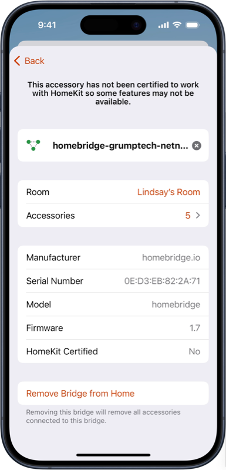
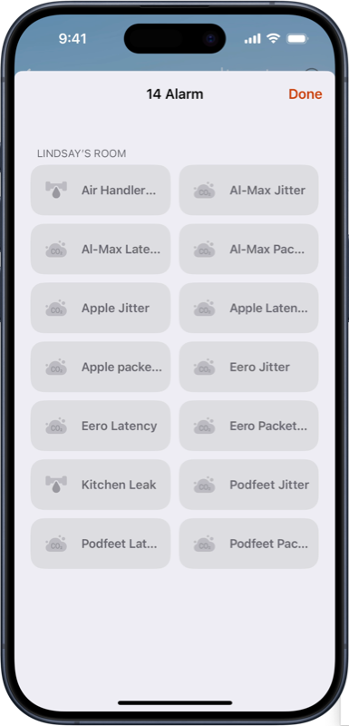
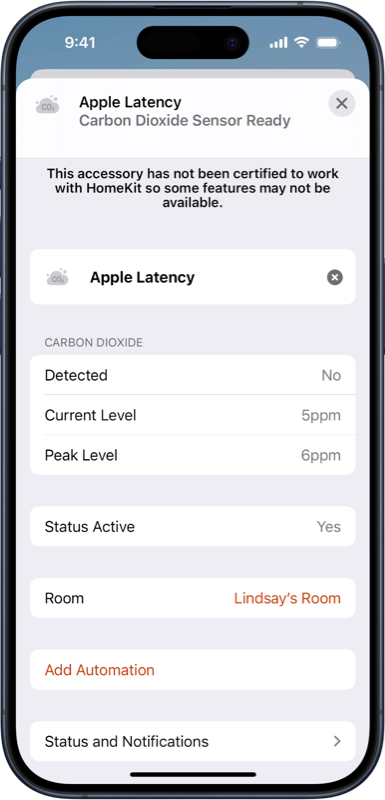
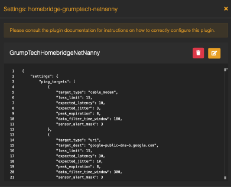
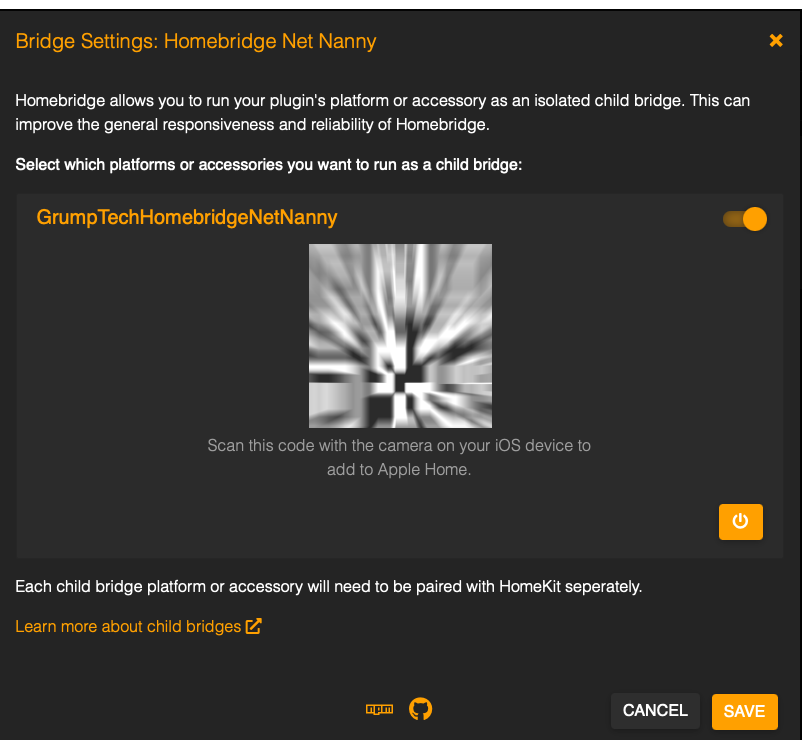

# Homebridge Net Nanny

[Homebridge Net Nanny](https://github.com/pricemi115/homebridge-grumptech-netnanny), by [GrumpTech](https://github.com/pricemi115/), is a [Homebridge](https://homebridge.io) dynamic platform plug-in that publishes metrics measuring the health of a network.
This plugin was inspired by [Dave Hamilton's](https://twitter.com/DaveHamilton), of the [Mac Geek Gab](https://www.macgeekgab.com), 3-Ping strategy for evaluating network health.

## What Problem Does Net Nanny Solve?

When we suffer network problems, it's sometimes hard to figure out whether the problem is on the local area network, a problem with your Internet service provider, or a problem with a service to which you're trying to connect. In order to isolate the problem, a good practice is to open a terminal window and ping your router, then your modem, and then a known-reliable server on the Internet.

The Net Nanny Homebridge plugin is designed to give you this information at a glance from within HomeKit. The Homebridge plugin creates a fake switch called Net Nanny, along with fake carbon dioxide (C02) sensors that will report your network health.

When configured properly, in the Home app, you'll see a set of "Alarm Sensors". These sensors will represent the targets you set up for network testing, e.g. your router, modem, and external server(s). Each target will have three sensors associated with it: one for latency, one for jitter, and one for packet loss. Because we're simulating devices, the sensors will report their metrics in units of ppm (parts per million), but the values are actually milliseconds. In other words, if you see a latency of 8 ppm, that means its latency is 8ms.

By having these sensors reporting these three metrics, you can get a sense of what normal looks like, and when things go wrong they could help you isolate the problem between your network and your ISP. 

## Change Log
The change history can be viewed [here](./CHANGELOG.md)

## Security Policy
Please refer to our [security policy](./SECURITY.md) for information on which versions are receiving security updates and how to report security vulnerabilities.

## Installation
This plug-in is intended to be used with the [homebridge-config-ui-x](https://www.npmjs.com/package/homebridge-config-ui-x) homebridge management tool. If using _homebridge-config-ui-x_, simply search for _homebridge-grumptech-netnanny_ for installation, plug-in management, and configuration.

To install the plugin manually:
 _`npm install -g homebridge-grumptech-netnanny`_

## Configuration
### _homebridge-config-ui-x_
This plugin is best experienced when running as a module installed and managed by the [_homebridge-config-ui-x_](https://www.npmjs.com/package/homebridge-config-ui-x) plugin. When running under homebridge-config-ui-x, visiting the plugin settings will allow you to change the polling interval and the low space alarm threshold, as shown below. 

 
For details on the configuration settings, please refer to the _Configuration Settings_ section below.

Additionally, especially if this system will be running other homebridge modules, it is strongly encouraged to run this plugin as an isolated child bridge. This setting page can be found by clicking on the _wrench_ icon on the plugin and then selecting _Bridge Settings_. With the child bridge enabled, revisiting the setting page after homebridge is rebooted will show a QR code for pairing to the child bridge. The username (MAC address) and port are randomly generated by homebridge-config-ui-x. 

### Configuration Settings
| Setting | Description | Field Name | Parameter Type | Data Type | Units | Default | Minimum or Allowed Values | Maximum | Comments |
| :------: | :------: | :------: | :------: | :------: |:------: | :------: | :------: | :------: | :------: |
| Ping Period | The time, in seconds, to initiate a series of ping requests. | ping_period | Common | Number | Time:seconds | 20 | 6 | N/A ||
| Ping Interval | The time, in seconds, between each ping request. | ping_interval | Common | Number | Time:seconds | 1 | 1 | N/A ||
| Ping Count | The number of ping request for each series. | ping_count | Common | Number | Count | 5 | 3 | N/A ||
| Packet Size | The size, in bytes, of each ping request. | packet_size | Common | Number | Bytes | 56 | 56 | N/A ||
| Enable History Logging | Enables / Disables logging of ping results | enable_history_logging | Common | Boolean | N/A | True | False | True ||
| History Reporting Period | The time, in days, for generating report logs of network performance | history_logging:reporting_period | Common | Number | Time:days | 1 | 0.041667 | 100 | |
| Maximum History Size | Maximum number of result sets to record in the history database | history_logging:maximum_history_size | Common | Number | N/A | 250000 | 2500 | 5000000 ||
| Oretention Period | Number of days to retain history log files. | history_logging:retention_period | Common | Number | Time:days | 30 | 1 | 365 ||
| Target Type | Type of target. | ping_targets:items:target_type | Per Target | String | N/A | ipv4 | uri, ipv4, ipv6, gateway, cable_modem |||
| Modem Type | Type of cable modem. | ping_targets:items:modem_type | Per Target | String | N/A | other | xfinity, netgear, other || Only valud when the target type is set to _cable_modem_ |
| Target Destination | Destination for the ping | ping_targets:items:target_dest | Per Target | String ||||| Not applicable for gateway or cable_modem |
| Packet Loss Limit | The limit, in percent, of lost packets that will be tolerated. | ping_targets:items:loss_limit | Per Target | Number | Percent | 5 | 0 | 100 ||
| Expected Latency | The expected latency, in milliseconds, for the ping. | ping_targets:items:expected_latency| Per Target | Number | Time:milliseconds | 10 | >0 | N/A ||
| Expected Jitter | The expected jitter, in milliseconds, of the ping latency. | ping_targets:items:expected_jitter | Per Target | Number | Time:milliseconds | 1 | >0 | N/A ||
| Peak Expiration Time | The time, in hours, used to reset the peak values. | ping_targets:items:peak_expiration | Per Target | Number | Time:hours | 12 | 0 | N/A ||
| Data Filter Time Window | The time, in seconds, over which to filter the ping results. | data_filter_time_window | Per Target | Number | Time:seconds | 180 | 6 | N/A | Values less than the 'Ping Period' will be ignored. |
| Sensor Alert | Indicates which of the Carbon Dioxide sensors issue CO2 aleets when the data exceeds specified limits. | sensor_alert_mask | Per Target | Number | Bitmask | 7 | 0 | 7 | Bit#0:Time, Bit#1:Packet Loss; Bit#2:Standard Deviation |

### Manual Configuration
If you would rather manually configure and run the plugin, you will find a sample _config.json_ file in the `./config` folder. It is left to the user to get the plugin up and running within homebridge. Refer to the section above for specifics on the configuration parameters.

## Usage
The plugin will create, or restore, a dynamic accessory for each network target specified in the configuration. Each accessory will advertise four services: (1) switch, and (3) carbon dioxide sensors . All of the data presented for the carbon dioxide sensors is the result of the ping results. In an effort to keep outliers from affecting the reported values, the data collected will be run through a filter, as discussed below. In addition to the services provided by each network targer, the plugin will adversise an additional a collection of switch services.

- **Power**: A switch, with the name of the Target Destination, that controls the active state of the network performance target.
- **Latency**: The average ping latency, in milliseconds. The peak value is also displayed. Alerts are triggered when the reported value exceeds: `Expected Latency + (3 * Expected Jitter)`
- **Jitter**: The jitter, in milliseconds, of the ping latency results. The peak value is also displayed. Alerts are triggered when the reported value exceeds: `Expected Jitter`
- **Packet Loss**: The packet loss, in percent. The peak value is also displayed. Alerts are triggered when the reported value exceeds: `Packet Loss Limit`
- **NetNanny-Switches**: A collection of switches. At the present time, this collection contains a single switch. This switch will be used perform an off-cycle export of the database and flush all existing data.

When the current value for any of the carbon dioxide sensors exceeds the user-specified expected limits, the sensor’s alert will be set and, in addition, the sensor’s _Detected_ value will be set to abnormal levels, if configured. Each Carbon Dioxide sensor can be configured to not set the _Detected_ value to abnormal when a fault is encountered. Setting the _Detected_ value to abnormal levels should result in am alert noticiation from HomeKit.

Because the ping results can be noisy, the results are filtered using the [AVT (Antonyan Vardan Transform)](https://en.wikipedia.org/wiki/AVT_Statistical_filtering_algorithm) algorithm. The amount of data considered in the filter is implicitly set via the _Data Filter Time Window_ configuration parameter on each network target. The size of the data buffer is computed as the ratio _Data Filter Time Window_ to _Ping Period_. The larger this ratio, the more ping results that will be considered in the filter. The value reported by the filter is the _median_ value after excluding the data points that are beyond one standard deviation. Therefore, one can assume that the alerts will not be detected until at least half of the _Data Filter Time Window_ has elapsed with raw results that exceed the user specified limits. This should have the tendency to limit false positive detections. However, if the ratio is too small (not enough data in the buffer), then the reporting will be more responsive and alerts will be issued for transient _glitches_ in the network performance that do not necessarially indicate a systemic problem.

It should also be noted, that the _Detected_ value will not be set to abnormal until the _Data Filter Time Window_ has elapsed after startup. This will prevent an occasional bad result from immediately resulting in the detection of abnormal carbon dioxide levels at startup.

When the accessory is inactive, the _Active_ and _Low Battery Status_ are set.

When _Enable History Logging_ is active, the filtered ping results will be stored in an in-memory database. The data will be exported to a CSV data file periodically or upon manual request. The exported data will be saved to a folder named _GrumpTechHomebridgeNetNanny_ located in the homebridge configuration folder. For example, on macOS `~/.homebridge/GrumpTechHomebridgeNetNanny/`.

## Restrictions
This module operates by using shell commands to the `ping` and `route` programs. At this time, the plugin assumes macOS output when parsing the results. While the `ping` output is consistent across operating systems, the `route` output is operating system specific. As a result, the `gateway/router` type selection is limited to macOS and linux.

## Known Issues and Planned Enhancements
Refer to the bugs and enhancements listed [here](https://github.com/pricemi115/homebridge-grumptech-netnanny/issues)

## Contributing
1. Fork it!
2. Create your feature/fix branch: `git checkout -b my-new-feature`
3. Commit your changes: `git commit -am 'Add some feature'`
4. Push to the branch: `git push origin my-new-feature`
5. Submit a pull request

## Credits
Many thanks to all the folks contributing to [Homebridge](https://homebridge.io) and to [oznu](https://github.com/oznu) for [homebridge-config-ui-x](https://www.npmjs.com/package/homebridge-config-ui-x), allowing for the possibility of this sort of fun and learning. 
Special thanks to [Dave Hamilton's](https://twitter.com/DaveHamilton), and the [MacGeekGab](https://www.macgeekgab.com) podcast for inspiring the idea for this plugin.

## License
Refer to [LICENSE.md](./LICENSE.md) for information regarding licensincg of this source code.